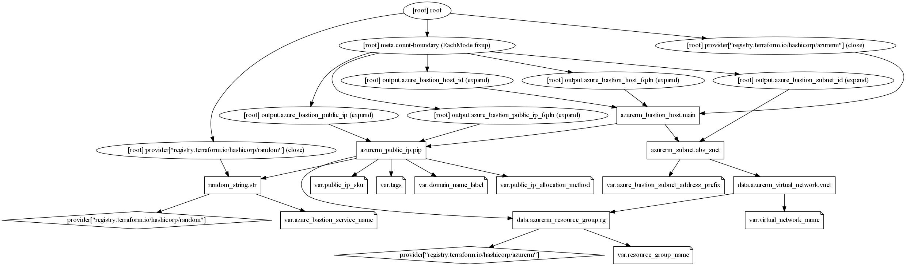

# Azure Bastion Service Terraform module

The Azure Bastion service is a fully platform-managed PaaS service that provision inside the virtual network. It provides secure and seamless RDP/SSH connectivity to the virtual machines directly in the Azure portal over TLS. When connecting via Azure Bastion, the virtual machines do not need a public IP address.

Azure Bastion deployment is per virtual network, not per subscription/account or virtual machine. Once provisioned an Azure Bastion service in the virtual network, the RDP/SSH experience is available to all the VMs in the same virtual network.

Microsoft first introduced Azure Bastion two years ago in preview as a secure remote desktop solution, which does not require organizations to expose virtual machines using public IP Addresses. Instead, the connectivity to virtual machines is provided through RDP and SSH over the Secure Sockets Layer (SSL) – the base functionality offered in the Basic SKU. Now, the company provide another SKU with Standard including premium features such as:

* Manual scaling of the Virtual Machine (VM) instances, facilitating Bastion connectivity from 2 up to 50 to manage the number of concurrent SSH and RDP sessions Azure Bastion can support.

* Support for IP-based connections – users can provide the IP address of the target VM/VMSS to allow Bastion to manage connectivity within the local/peered virtual network and on-premises and other cloud providers' networks.

* An Azure Bastion admin panel provides the enabling/disabling features accessed by the Bastion host. Furthermore, users can upgrade from Basic to Standard SKU with the panel, configure access to IP-based connection, and manage VM manual scaling.

## Module Usage

```hcl
# Azurerm Provider configuration
provider "azurerm" {
  features {}
}

module "azure-bastion" {
  source  = "kumarvna/azure-bastion/azurerm"
  version = "1.2.0"

  # Resource Group, location, VNet and Subnet details
  resource_group_name  = "rg-shared-westeurope-01"
  virtual_network_name = "vnet-shared-hub-westeurope-001"

  # Azure bastion server requireemnts
  azure_bastion_service_name          = "mybastion-service"
  azure_bastion_subnet_address_prefix = ["10.1.5.0/26"]
  bastion_host_sku                    = "Standard"
  scale_units                         = 10

  # Adding TAG's to your Azure resources (Required)
  tags = {
    ProjectName  = "demo-internal"
    Env          = "dev"
    Owner        = "user@example.com"
    BusinessUnit = "CORP"
    ServiceClass = "Gold"
  }
}
```

## Pre-requisites

### Virtual network

You can create a new virtual network in the portal during this process, or use an existing virtual network to create Azure bastion service. If you are using an existing virtual network, make sure the existing virtual network has enough free address space to accommodate the Bastion subnet requirements.

### Subnet

The subnet will be dedicated to the Bastion host and must be named as `AzureBastionSubnet`. This subnet must be at least `/27` or larger.  User-defined routing (UDR) is not supported on an Azure Bastion subnet. For scenarios that include both Azure Bastion and Azure Firewall/Network Virtual Appliance (NVA) in the same virtual network, you don’t need to force traffic from an Azure Bastion subnet to Azure Firewall because the communication between Azure Bastion and your VMs is private.

### Public IP address

The public IP of the Bastion resource on which RDP/SSH will be accessed (over port 443). Create a new public IP, or use an existing one. The public IP address must be in the same region as the Bastion resource you are creating.  Public IP address SKU by default to `Standard` and Azure Bastion uses/supports only the Standard Public IP SKU with a static assignment.

## Requirements

Name | Version
-----|--------
terraform | >= 0.13
azurerm | >= 2.59.0

## Providers

| Name | Version |
|------|---------|
azurerm |>= 2.59.0

## Inputs

Name | Description | Type | Default
---- | ----------- | ---- | -------
`resource_group_name` | The name of the resource group in which resources are created | string | `""`
`virtual_network_name`|The name of the virtual network|string|`""`
`public_ip_allocation_method`|Defines the allocation method for this IP address. Possible values are `Static` or `Dynamic`|static|`"Static"`
`public_ip_sku`|The SKU of the Public IP. Accepted values are `Basic` and `Standard`|string|`"Standard"`
`domain_name_label`|Label for the Domain Name. Will be used to make up the FQDN. If a domain name label is specified, an A DNS record is created for the public IP in the Microsoft Azure DNS system|string|`null`
`azure_bastion_service_name`|Specifies the name of the Bastion Host|string|`""`
`azure_bastion_subnet_address_prefix`|The address prefix to use for the Azure Bastion subnet|list|`[]`
`enable_copy_paste`|Is Copy/Paste feature enabled for the Bastion Host?|string|`true`
`enable_file_copy`|Is File Copy feature enabled for the Bastion Host. Only supported whne `sku` is `Standard`|string|`false`
`bastion_host_sku`|The SKU of the Bastion Host. Accepted values are `Basic` and `Standard`"|string|`Basic`
`enable_ip_connect`|Is IP Connect feature enabled for the Bastion Host?|string|`false`
`scale_units`|The number of scale units with which to provision the Bastion Host. Possible values are between `2` and `50`. `scale_units` only can be changed when `sku` is `Standard`. `scale_units` is always `2` when `sku` is `Basic`.|string|`2`
`enable_shareable_link`|Is Shareable Link feature enabled for the Bastion Host. Only supported whne `sku` is `Standard`|string|`false`
`enable_tunneling`|Is Tunneling feature enabled for the Bastion Host. Only supported whne `sku` is `Standard`|string|`false`
`tags`|A map of tags to add to all resources|map(string)|`{}`

## Outputs

Name | Description
---- | -----------
`azure_bastion_subnet_id`|The resource ID of Azure bastion subnet
`azure_bastion_public_ip`|The public IP of the virtual network gateway
`azure_bastion_public_ip_fqdn`|Fully qualified domain name of the virtual network gateway
`azure_bastion_host_id`|The resource ID of the Bastion Host
`azure_bastion_host_fqdn`|The FQDN of the Bastion Host

## Resource Graph



## Authors

Originally created by [Kumaraswamy Vithanala](mailto:kumarvna@gmail.com)

## Other resources

* [Azure Bastion Service](https://docs.microsoft.com/en-us/azure/bastion/bastion-overview#next-steps)
* [Terraform AzureRM Provider Documentation](https://www.terraform.io/docs/providers/azurerm/index.html)
